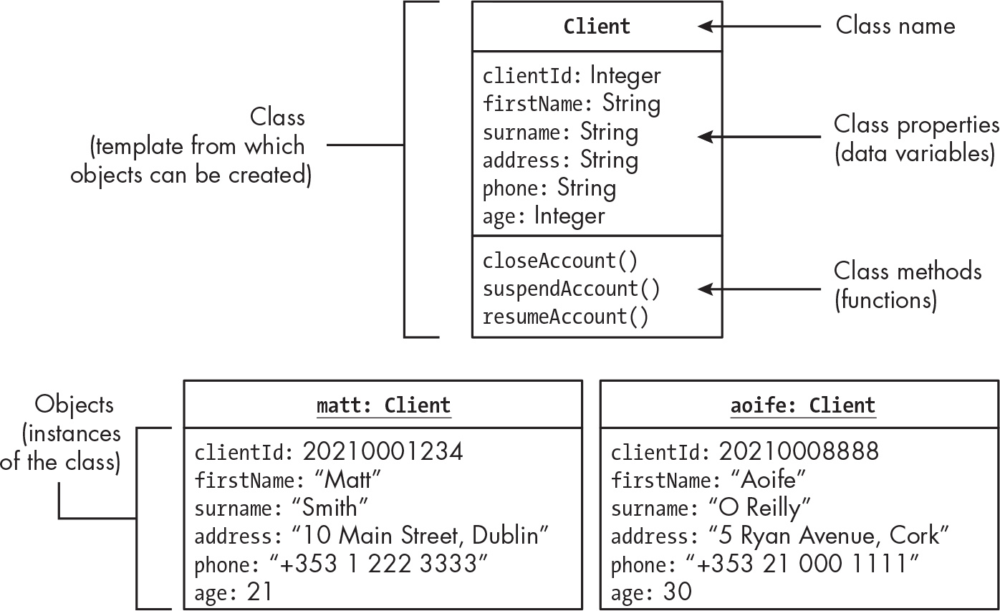
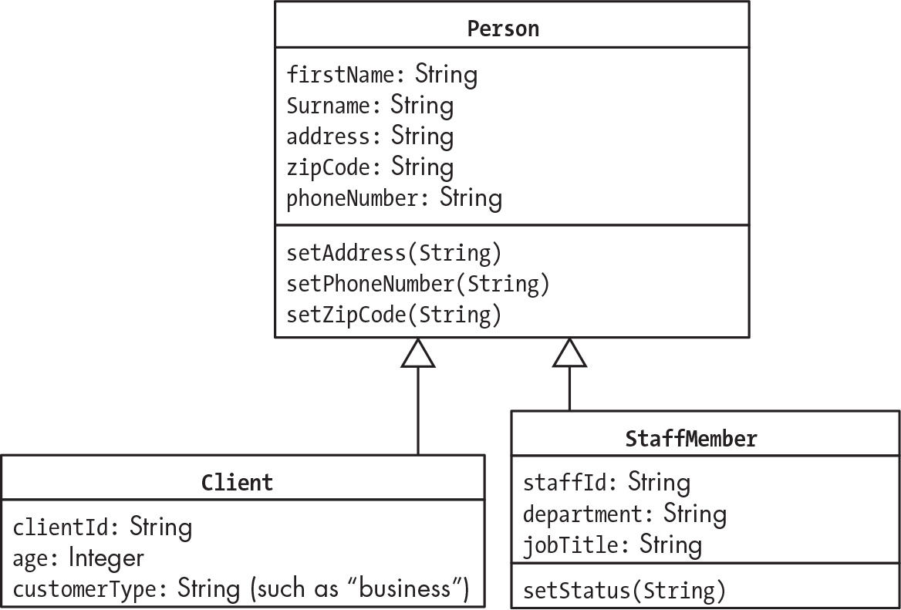

# Programación Orientada a Objetos
Un programa orientado a objetos está hecho de archivos PHP que declaran clases. Una clase se puede ver como una plantilla donde se crean los objetos. Declarar una clase en PHP realmente no hace nada por sí solo. 

Hay gente que se refiere a un objeto como a una "instancia" de una clase, ya que cada objeto es una manifestación de las características y comportamientos que están definidos por la clase. Podemos decir que "objeto" e "instancia" son sinónimos; un objeto en la memoria del ordenador que se ha creado de una plantilla (la clase), con unos valores y una capacidad de responder y ejecutar funciones.



> Ejemplo del libro [PHP Crash Course](https://learning.oreilly.com/library/view/php-crash-course/9798341620049/) de O'Reilly

Las variables definidas dentro de la clase son **propiedades**. Las funciones declaradas dentro de la clase se llaman **métodos**. Todo en conjunto se llama **miembro**. 

En ese ejemplo, cada objeto creado de la clase "Cliente" tiene sus propias propiedades pero tienen acceso a sus mismos métodos que están definidos en la Clase.

## Creación de relaciones entre objetos
Con la POO podemos crear relaciones entre objetos simplemente vinculando una propiedad de un objeto con otro objeto. Se suelen relacionar objetos de la misma clase. Por ejemplo, si una persona es padre de otra persona.

Para evitar que se puedan editar los datos al gusto, podemos usar `public`, `private`, o `protected` para declarar distintos tipos de acceso a las propiedades y métodos de una clase de objetos. Si queremos que no se pueda editar la edad del cliente haciendola privada, podemos declarar un método `setAge()` para actualizar la edad sólo si se cumplen algunos requisitos de validación.

## Superclases, Herencia y anulación
Podemos asignar propiedades y métodos que son comunes entre clases a una superclase. Una superclase seria una clase generalizada de donde otras clases pueden sacar características. 



> Ejemplo del libro [PHP Crash Course](https://learning.oreilly.com/library/view/php-crash-course/9798341620049/) de O'Reilly

Las superclases y la herencia permiten que no tengamos que duplicar código entre clases.

En PHP, si queremos reemplazar un método símplemente tenemos que declarar otra vez el método en la subclase para reemplazarlo. 

## Flujo de control para sistemas orientados a objetos

El flujo de control en un PHP procedural normalmente se lleva mediante un controlador `index.php`, donde cuando se recibe una petición HTTP, se ejecuta lo que se encuentre en ese archivo. 

En una aplicación orientada a objetos, se mantiene el `index.php`, pero tenemos que crear el objeto de la aplicación principal. 

## Ejemplo de declaración de Clase
```php
<?php

// Declaramos la clase Player
class Player
{
    private string $name; // Propiedad: NOMBRE
    private int $highScore = 0; // Propiedad: PuntuacionAlta
    /* Por defecto highScore es 0 */

    public function setName(string $name)
    /*
    Función para cambiar el nombre, ya que el
    string es privado 
    */
    {
        $this->name = $name; // Se cambia el name del objeto a $name
    }

    public function setHighScore(int $newScore)
    /*
    Función para cambiar la puntuación alta, ya
    que es privada
    */
    {
        if ($newScore > $this->highScore) {
            $this->highScore = $newScore; // Se cambia el highScore del objeto a $newScore
        }
    }
}

/*
`$this` se refiere al objeto desde el que se ha llamado al método
*/
```

# Creando Clases y Objetos
## Creación de Clases
Una declaración de clase define las propiedades que cada objeto de la clase va a tener y los métodos que podrán funcionar con cada una de las propiedades. 

La clase también establece las relaciones que puede tener con otras clases (herencia).

Las clases se guardan en archivos PHP en el directorio del proyecto. Lo suyo es declarar las clases en archivos separados, es decir, si tenemos 3 clases, lo guardamos en 3 archivos distintos.

Para definir las clases, siempre se empieza por una mayúscula y sin espacios. `Persona`, `Animal`, `Centro`, etc.

```php
<?php
# -- producto.php --
class Producto 
{
    public string $nombre;
    public string $precio = 0;
}
```

Queremos que el objeto de precio tenga un valor por defecto de 0, por lo que le podemos asignar a la propiedad un valor en la declaración de la clase, como he hecho.

## Creación de Objetos
Para crear un objeto de una clase, usamos la palabra `new` seguida del nombre de la clase.

```php
<?php
$producto1 = new Producto();
$producto1->nombre = "bolsa";
?>
```

Usando `new Producto` creamos el nuevo objeto y devolvemos una referencia a él que guardamos en la variable `$producto1`. 

`$producto1` no contiene el objeto ni la copia, sólo tiene la referencia al objeto creada en la memoria del ordenador. Con `->` nos referimos a la propiedad del objeto

## Propiedades privadas con métodos de acceso públicos
Cuando se declara como `private`, no se pueden acceder por código fuera de la declaración de la clase, pero sí son accesibles por los métodos. Con eso podemos reducir el riesgo de introducir propiedades inválidas. 

La visibilidad por defecto en los miembros de la clase es `public` si no se declara nada, aunque es buena práctica usar el `public` cuando se quiere decir que es público. Para hacerlo privado usamos `private`.


En casi todos los lenguajes de POO, se suelen usar los "getter" y "setter", que son métodos que sacan (get) o establecen (set) información. Las propiedades según eso deberían ser como `getName()`, `setAge()`. Para booleanos, es mejor usar `is`, como `isPropertyName` en vez de `getPropertyName`. 

Cuando se crean métodos, hay que tener en cuenta que se van a ejecutar los mismos métodos en 0, 1, o miles de objetos, por lo que hay que tener en cuenta eso. Las clases que están bien escritas se pueden reusar.

> Hay editores como **PHPStorm** que te crean los getter y setter

## __construct
El método `__construct` es un método especial que se ejecuta automáticamente cuando se crea un nuevo objeto de la clase. Se suele usar para inicializar las propiedades del objeto con valores específicos.

```php
<?php
class Producto 
{
    public string $nombre;
    public string $precio = 0;

    public function __construct(string $nombre, string $precio)
    {
        $this->nombre = $nombre;
        $this->precio = $precio;
    }
}
```
En este ejemplo, el método `__construct` toma dos parámetros, `$nombre` y `$precio`, y los asigna a las propiedades del objeto usando `$this->`. Cuando se crea un nuevo objeto de la clase `Producto`, se pueden pasar los valores para el nombre y el precio directamente al constructor:

```php
$producto1 = new Producto("bolsa", "10");
```
Esto creará un nuevo objeto `Producto` con el nombre "bolsa" y el precio "10". El método `__construct` es una forma conveniente de asegurarse de que los objetos se inicializan correctamente con los valores necesarios desde el momento en que se crean.

## Convertir Objeto a String
No tenemos que implementar una función `_toString()` para cada clase, pero tenemos que si necesitamos cosas más complejas a lo mejor habrá que hacerlo. 

```php
<?php
print $producto1
```
