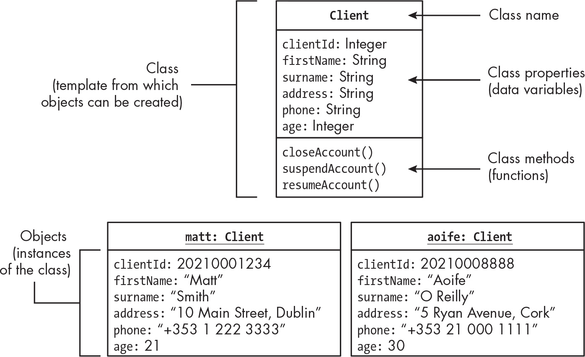
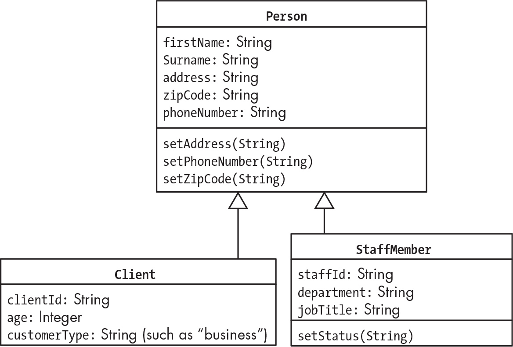
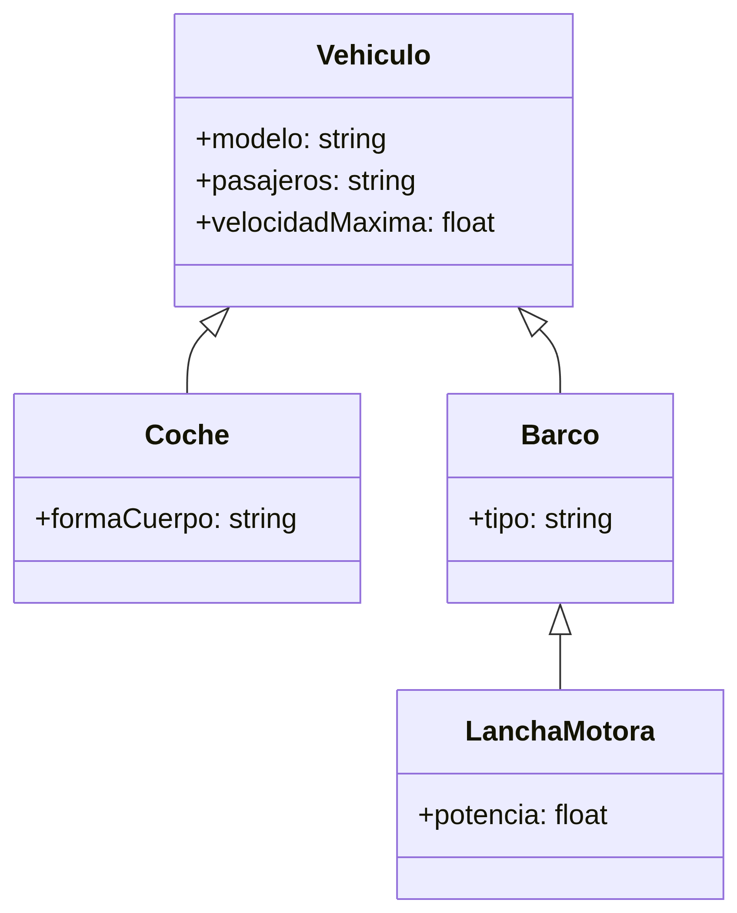
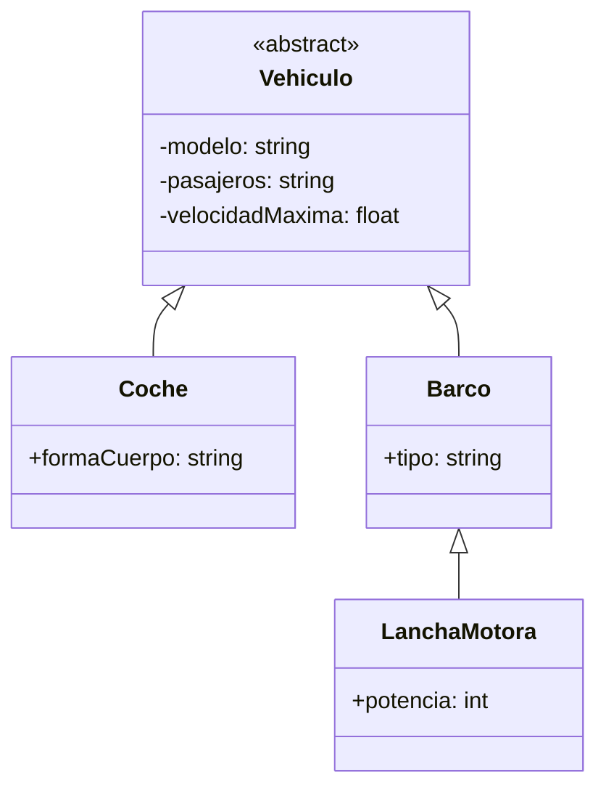

# Programación Orientada a Objetos
Un programa orientado a objetos está hecho de archivos PHP que declaran clases. Una clase se puede ver como una plantilla donde se crean los objetos. Declarar una clase en PHP realmente no hace nada por sí solo. 

Hay gente que se refiere a un objeto como a una "instancia" de una clase, ya que cada objeto es una manifestación de las características y comportamientos que están definidos por la clase. Podemos decir que "objeto" e "instancia" son sinónimos; un objeto en la memoria del ordenador que se ha creado de una plantilla (la clase), con unos valores y una capacidad de responder y ejecutar funciones.



> Ejemplo del libro [PHP Crash Course](https://learning.oreilly.com/library/view/php-crash-course/9798341620049/) de O'Reilly

Las variables definidas dentro de la clase son **propiedades**. Las funciones declaradas dentro de la clase se llaman **métodos**. Todo en conjunto se llama **miembro**. 

En ese ejemplo, cada objeto creado de la clase "Cliente" tiene sus propias propiedades pero tienen acceso a sus mismos métodos que están definidos en la Clase.

## Creación de relaciones entre objetos
Con la POO podemos crear relaciones entre objetos simplemente vinculando una propiedad de un objeto con otro objeto. Se suelen relacionar objetos de la misma clase. Por ejemplo, si una persona es padre de otra persona.

Para evitar que se puedan editar los datos al gusto, podemos usar `public`, `private`, o `protected` para declarar distintos tipos de acceso a las propiedades y métodos de una clase de objetos. Si queremos que no se pueda editar la edad del cliente haciendola privada, podemos declarar un método `setAge()` para actualizar la edad sólo si se cumplen algunos requisitos de validación.

## Superclases, Herencia y anulación
Podemos asignar propiedades y métodos que son comunes entre clases a una superclase. Una superclase seria una clase generalizada de donde otras clases pueden sacar características. 



> Ejemplo del libro [PHP Crash Course](https://learning.oreilly.com/library/view/php-crash-course/9798341620049/) de O'Reilly

Las superclases y la herencia permiten que no tengamos que duplicar código entre clases.

En PHP, si queremos reemplazar un método símplemente tenemos que declarar otra vez el método en la subclase para reemplazarlo. 

## Flujo de control para sistemas orientados a objetos

El flujo de control en un PHP procedural normalmente se lleva mediante un controlador `index.php`, donde cuando se recibe una petición HTTP, se ejecuta lo que se encuentre en ese archivo. 

En una aplicación orientada a objetos, se mantiene el `index.php`, pero tenemos que crear el objeto de la aplicación principal. 

## Ejemplo de declaración de Clase
```php
<?php

// Declaramos la clase Player
class Player
{
    private string $name; // Propiedad: NOMBRE
    private int $highScore = 0; // Propiedad: PuntuacionAlta
    /* Por defecto highScore es 0 */

    public function setName(string $name)
    /*
    Función para cambiar el nombre, ya que el
    string es privado 
    */
    {
        $this->name = $name; // Se cambia el name del objeto a $name
    }

    public function setHighScore(int $newScore)
    /*
    Función para cambiar la puntuación alta, ya
    que es privada
    */
    {
        if ($newScore > $this->highScore) {
            $this->highScore = $newScore; // Se cambia el highScore del objeto a $newScore
        }
    }
}

/*
`$this` se refiere al objeto desde el que se ha llamado al método
*/
```

# Creando Clases y Objetos
## Creación de Clases
Una declaración de clase define las propiedades que cada objeto de la clase va a tener y los métodos que podrán funcionar con cada una de las propiedades. 

La clase también establece las relaciones que puede tener con otras clases (herencia).

Las clases se guardan en archivos PHP en el directorio del proyecto. Lo suyo es declarar las clases en archivos separados, es decir, si tenemos 3 clases, lo guardamos en 3 archivos distintos.

Para definir las clases, siempre se empieza por una mayúscula y sin espacios. `Persona`, `Animal`, `Centro`, etc.

```php
<?php
# -- producto.php --
class Producto 
{
    public string $nombre;
    public string $precio = 0;
}
```

Queremos que el objeto de precio tenga un valor por defecto de 0, por lo que le podemos asignar a la propiedad un valor en la declaración de la clase, como he hecho.

## Creación de Objetos
Para crear un objeto de una clase, usamos la palabra `new` seguida del nombre de la clase.

```php
<?php
$producto1 = new Producto();
$producto1->nombre = "bolsa";
?>
```

Usando `new Producto` creamos el nuevo objeto y devolvemos una referencia a él que guardamos en la variable `$producto1`. 

`$producto1` no contiene el objeto ni la copia, sólo tiene la referencia al objeto creada en la memoria del ordenador. Con `->` nos referimos a la propiedad del objeto

## Propiedades privadas con métodos de acceso públicos
Cuando se declara como `private`, no se pueden acceder por código fuera de la declaración de la clase, pero sí son accesibles por los métodos. Con eso podemos reducir el riesgo de introducir propiedades inválidas. 

La visibilidad por defecto en los miembros de la clase es `public` si no se declara nada, aunque es buena práctica usar el `public` cuando se quiere decir que es público. Para hacerlo privado usamos `private`.


En casi todos los lenguajes de POO, se suelen usar los "getter" y "setter", que son métodos que sacan (get) o establecen (set) información. Las propiedades según eso deberían ser como `getName()`, `setAge()`. Para booleanos, es mejor usar `is`, como `isPropertyName` en vez de `getPropertyName`. 

Cuando se crean métodos, hay que tener en cuenta que se van a ejecutar los mismos métodos en 0, 1, o miles de objetos, por lo que hay que tener en cuenta eso. Las clases que están bien escritas se pueden reusar.

> Hay editores como **PHPStorm** que te crean los getter y setter

## __construct
El método `__construct` es un método especial que se ejecuta automáticamente cuando se crea un nuevo objeto de la clase. Se suele usar para inicializar las propiedades del objeto con valores específicos.

```php
<?php
class Producto 
{
    public string $nombre;
    public string $precio = 0;

    public function __construct(string $nombre, string $precio)
    {
        $this->nombre = $nombre;
        $this->precio = $precio;
    }
}
```
En este ejemplo, el método `__construct` toma dos parámetros, `$nombre` y `$precio`, y los asigna a las propiedades del objeto usando `$this->`. Cuando se crea un nuevo objeto de la clase `Producto`, se pueden pasar los valores para el nombre y el precio directamente al constructor:

```php
$producto1 = new Producto("bolsa", "10");
```
Esto creará un nuevo objeto `Producto` con el nombre "bolsa" y el precio "10". El método `__construct` es una forma conveniente de asegurarse de que los objetos se inicializan correctamente con los valores necesarios desde el momento en que se crean.

## Convertir Objeto a String
No tenemos que implementar una función `_toString()` para cada clase, pero tenemos que si necesitamos cosas más complejas a lo mejor habrá que hacerlo. 

```php
<?php
print $producto1
```


# Herencia
Permite que una o más clases (llamadas subclases) puedan tener las mismas propiedades o métodos que otra clase llamada "superclase".

La herencia simplifica el código al identificar y generalizar las propiedades y métodos comunes a varias clases y colocarlos en una superclase.

```php
<?php
class Vehiculo
{
    public string $modelo;
    public string $pasajeros;
    public float $velocidadMaxima;
}
```
Aquí la clase Vehículo es una clase que tiene propiedades comunes a muchos tipos de vehículos. Podemos crear subclases que hereden de esta clase para representar tipos específicos de vehículos, como coches, motos, camiones, etc.

```php
class Coche extends Vehiculo 
{
    public string $formaCuerpo;
}
```

Ahora podemos crear un objeto cohce y darle los valores para cada una de sus propiedades, las definidas en Coche y las que vienen de la subclase Coche.

```php
$coche1 = new Coche();
$coche1->formaCuerpo='Sedan';
$coche1->modelo='Ford Mustang';
$coche1->pasajeros=5;
$coche1->velocidadMaxima=160;
```

Aqui dejo un esquema Mermaid de como podemos representar la herencia entre clases. Se puede ver que la clase Coche hereda las propiedades de la clase Vehiculo, y además tiene su propia propiedad formaCuerpo. También barco hereda de vehículo y lanchaMotora hereda de barco, por lo que lanchaMotora también hereda las propiedades de vehículo.



## Visibilidad Protegida
Cuando un método o propiedad se declara `protected`, se convierte accesible para cualquier subclase de la clase en la que se ha declarado, pero no es accesible desde fuera de la clase o sus subclases. Esto permite que las subclases puedan usar y modificar los métodos y propiedades protegidos de la superclase, pero evita que el código externo pueda acceder a ellos directamente.

Es más restrictiva que pública, pero menos restrictiva que privada. Es útil para permitir que las subclases tengan acceso a ciertos métodos o propiedades sin exponerlos al código externo.

```php
<?php
class Vehiculo
{
    protected string $modelo;
    protected string $pasajeros;
    protected float $velocidadMaxima;
}
``` 
En este ejemplo, las propiedades `modelo`, `pasajeros` y `velocidadMaxima` son protegidas, lo que significa que solo pueden ser accedidas por la clase `Vehiculo` y sus subclases, como `Coche`. El código externo no podrá acceder a estas propiedades directamente, pero las subclases podrán usarlas y modificarlas según sea necesario.

Mantener la propiedad `private` en vez de `protected` o `public` es una buena práctica para encapsular los datos y proteger la integridad de los objetos, ya que evita que el código externo pueda modificar directamente las propiedades del objeto sin pasar por métodos de acceso controlados. Esto ayuda a mantener la consistencia y seguridad de los datos dentro de la clase.

## Clases Abstractas
Una clase abstracta es aquella que no se va a usar nunca para crear objetos directamente. Se declaran para ser usadas como superclases de otras clases. Por ejemplo, la clase `Vehiculo` podría ser una clase abstracta, ya que no tiene sentido crear un objeto de tipo `Vehiculo` directamente, sino que se usaría como base para crear objetos de tipo `Coche`, `Barco`, etc.


```mermaid
classDiagram
    class Vehiculo {
        <<abstract>>
        -modelo: string
        -pasajeros: string
        -velocidadMaxima: float
    }
    class Coche {
        +formaCuerpo: string
    }
    class Barco {
        +tipo: string
    }
    class LanchaMotora {
        +potencia: int
    }
    Vehiculo <|-- Coche
    Vehiculo <|-- Barco
    Barco <|-- LanchaMotora
```
En este diagrama, `Vehiculo` es una clase abstracta que no se puede instanciar directamente, pero sirve como base para las clases `Coche`, `Barco` y `LanchaMotora`, que heredan sus propiedades y pueden ser instanciadas para crear objetos específicos de cada tipo de vehículo.

En vez de poner `class Vehicle`, como no vamos a declarar objetos de tipo `Vehiculo`, podemos poner `abstract class Vehiculo` para indicar que es una clase abstracta. Esto hace que el código sea más claro y evita que se puedan crear objetos de tipo `Vehiculo` por error.

```php
<?php
abstract class Vehiculo
{
    protected string $modelo;
    protected string $pasajeros;
    protected float $velocidadMaxima;
}
```

Ahora, si intentamos crear un objeto de la clase `Vehiculo`, nos dará un error.

```
Fatal error: Uncaught Error: Cannot instantiate abstract class Vehiculo in ...
```

## Reemplazando métodos con herencia
En algunos casos podríamos necesirtar cambiar cómo un método heredado funciona en la subclase. Para eso, lo tenemos que **reemplazar**. Sólo se hace definiendo el método directamente en la subclase y dándole el mismo nombre que el método heredado de la superclase.

```php
<?php
class Vehiculo
{
    protected string $modelo;
    protected string $pasajeros;
    protected float $velocidadMaxima;
    public function acelerar()
    {
        echo "El vehículo está acelerando a su velocidad máxima de " . $this->velocidadMaxima . " km/h.";
    }
}
class Coche extends Vehiculo 
{
    public string $formaCuerpo;
    public function acelerar()
    {
        echo "El coche " . $this->modelo . " está acelerando a su velocidad máxima de " . $this->velocidadMaxima . " km/h.";
    }
}
```
En este ejemplo, la clase `Coche` reemplaza el método `acelerar()` heredado de la clase `Vehiculo` con su implementación específica adaptada para ESA clase.

## Aumentando el comportamiento de un método heredado
A veces, en vez de reemplazarlo entero, sólo queremos añadir algo al método heredado. Para eso, podemos usar la palabra clave `parent` para llamar al método de la superclase dentro del método de la subclase.

```php
<?php
class Coche extends Vehiculo 
{
    public string $formaCuerpo;
    public function acelerar()
    {        parent::acelerar(); // Llama al método acelerar() de la superclase Vehiculo
        echo "¡El coche está acelerando!";
    }
}
```
Aqui el método `acelerar()` de la clase Coche se ejecuta primero gracias al `parent::acelerar()`, que llama al método `acelerar()` de la clase `Vehiculo`, y luego se ejecuta el código adicional que imprime "¡El coche está acelerando!".

En vez de usar `parent::` para acceder al método de una superclase, nos podemos referir a la superclase por su nombre. En este caso, sería `Coche::`.

```php
<?php
class Coche extends Vehiculo
{
    public string $formaCuerpo;
    public function acelerar()
    {        Coche::acelerar(); // Llama al método acelerar() de la superclase Vehiculo
        echo "¡El coche está acelerando!";
    }
}
```
En este caso, `Coche::acelerar()` también llama al método `acelerar()` de la clase `Coche`, pero usando el nombre de la clase en lugar de `parent`.

Normalmente se usa para crear constructores en subclases que llaman al constructor de la superclase para asegurarse de que las propiedades heredadas se inicializan correctamente.

```php
<?php
class Coche extends Vehiculo
{
    public string $formaCuerpo;
    public function __construct(string $modelo, string $pasajeros, float $velocidadMaxima, string $formaCuerpo)
    {
        parent::__construct($modelo, $pasajeros, $velocidadMaxima);
        $this->formaCuerpo = $formaCuerpo; 
    }
}
```

## Prevención de Subclasificaciones y anulaciones
En algunas situaciones, podemos no querer que una subclase se cree a partir de una clase que hemos declarado. Para eso, podemos declarar la clase con la palabra `final`, que indica que esa es la clase FINAL y no se pueden crear subclases a partir de ella.

```php
<?php
final class Coche extends Vehiculo
{
    public string $formaCuerpo;
}
```

Lo suyo es sólo declarar clases o métodos como `final` si realmente tenemos una justificación para hacerlo. Por ejemplo, si tenemos una librería API, podemos declarar algunos métodos como `final` para evitar que los usuarios de la API los reemplacen y rompan la funcionalidad de la API.

### Método final
Si queremos que un método no se pueda reemplazar en las subclases, podemos declararlo como `final` para que las subclasees no puedan reemplazar los métodos pero permitiendo que se pueda seguir heredando.

```php
<?php
class Vehiculo
{
    protected string $modelo;
    protected string $pasajeros;
    protected float $velocidadMaxima;
    final public function acelerar()
    {
        echo "El vehículo está acelerando a su velocidad máxima de " . $this->velocidadMaxima . " km/h.";
    }
}
```

Aquí, la función `acelerar()` no se podrá reemplazar en ninguna subclase de `Vehículo`. Esto hará que el funcionamiento de `acelerar()` sea el mismo en todas las subclases.

((INTRODUCIR LINK A EJERCICIOS SUBCLASES))

# Administración de clases y espacios de nombres con Composer
Cuando los proyectos de PHP se van haciendo cada vez más grandes, puede ocurrir que haya una colisión de nombres o tener dos clases con el mismo nombre. Para evitarlo, se usan los _namespaces_, que es una solución que dan los lenguajes de programación orientados a objetos para evitar la colisión de nombres.

Las colisiones de nombres pueden ocurrir en algunos casos:

- Intentar declarar una clase con el mismo nombre a una de las clases ya existentes del lenguaje de PHP, como `Error`, `Directory`, o `Generator`.

- Intentar declarar dos clases en distintos directorios

- Combinar nuestras clases con clases de terceros. 

## `Namespaces`
Se usan para prevenir colisiones de nombres. Las clases se organizan en espacios de nombres y en subespacios de nombres.

```
Espacionombre\Subespacio\Clase
```

`Espacionombre` sería el espaacio de nombres principal, `Subespacio` sería un subespacio dentro del espacio de nombres, y `Clase` sería la clase que se encuentra dentro del subespacio.

Las clases que están en el lenguaje de PHP se encuentran en el espacio de nombres raíz.

### Creación de espacios de nombres
Para crear un espacio de nombres, usamos la palabra `namespace` seguida del nombre del espacio de nombres que queremos crear. Por ejemplo:

```php
<?php
namespace Osu;
class Player 
{
    private string $name;
    private int $highScore = 0;

    public function setName(string $name)
    {
        $this->name = $name;
    }

    public function setHighScore(int $newScore)
    {
        if ($newScore > $this->highScore) {
            $this->highScore = $newScore;
        }
    }
}
```
### Usar el espacio de nombres
Una vez la clase está declarada para estár en el espacio de nombres, tenemos que informar a PHP de que es la clase que queremos usar. Se puede hacer de dos maneras:

- La primera opción es usar el nombre del espacio cuando se crea el objeto, como `new Osu\Player()`. 

```php
<?php
require_once 'osu.php';
$player1 = new Osu\Player();
```

- La segunda opción es usar el `use` antes de llamar a la clase para importar el espacio de nombres:


```php
use Osu\Player;
require_once 'osu.php';
$player1 = new Player();
```

### Referenciando espacios de nombre en declaraciones de clases
Cuando se trabaja dentro de un namespace definido, PHP asume que la clase pertenece siempre al namespace actual. Con `\` indicamos el espacio de nombres global (root). Para acceder a clases integradas de PHP como `Datetime` desde un archivo con un namespace, tendremos que usar `\Datetime` para referenciar la clase desde el espacio de nombres global.

```php
<?php
namespace Osu;
class Player 
{
    private string $name;
    private int $highScore = 0;
    public function getCurrentTime()
    {
        $currentTime = new \DateTime(); // Referencia a la clase DateTime del espacio de nombres global
        return $currentTime->format('Y-m-d H:i:s');
    }
}
```
Usar `use` es como si fuera un alias o importación al inicio del archivo. Usando `use Osu;` podemos usar el namespace de Osu sin tener que escribir `Osu\` cada vez que queramos usar una clase de ese namespace. 

```php
<?php
use Osu; 
require_once 'osu.php';
$player1 = new Osu\Player();
```
## Composer
Es un programa de línea de comandos para ayudar con la POO en PHP. Ayuda con las clases y los archivos de declaración de funciones. Facilita trabajar con clases de distintos espaacios de nombres.

(No entro aqui ahora)

# Twig - Motor de plantillas para PHP
(NO entro aqui ahora)

# Estructura de un proyecto orientado a objetos
(NO entro aqui ahora)

# ERROR HANDLING - Manejo de errores en PHP
Las aplicaciones no siempre funcionan como queremos, por eso tenemos que usar excepciones.

Las excepciones son las clases que proporcionan información sobre los errores que ocurren en el programa.


